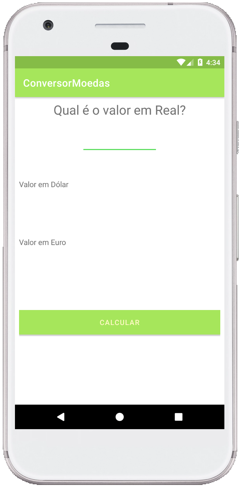
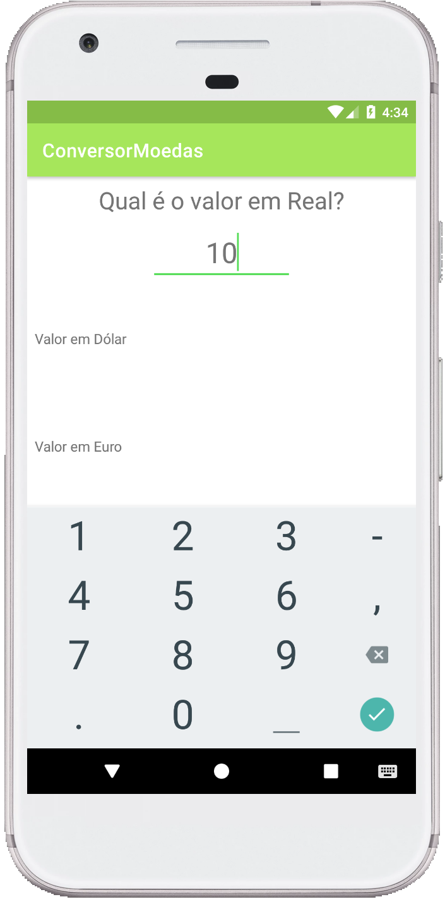
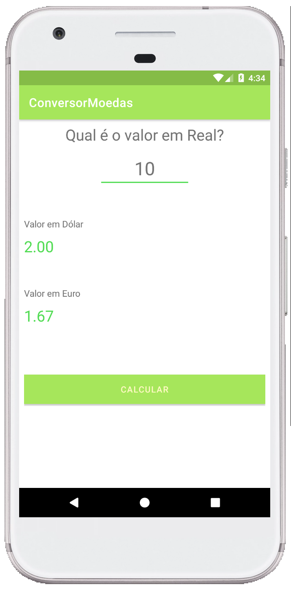
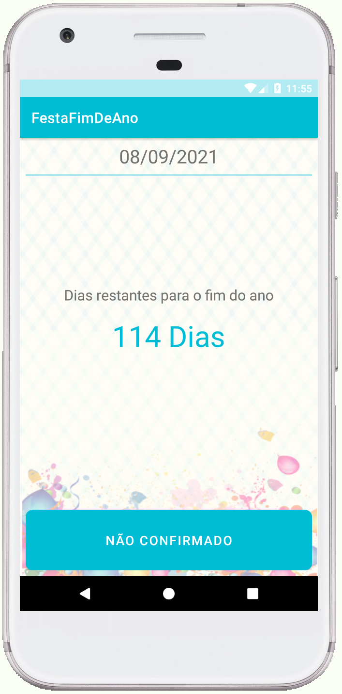
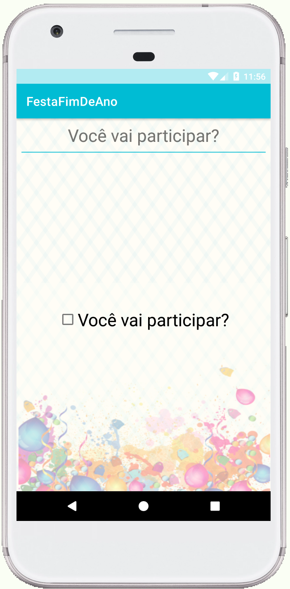
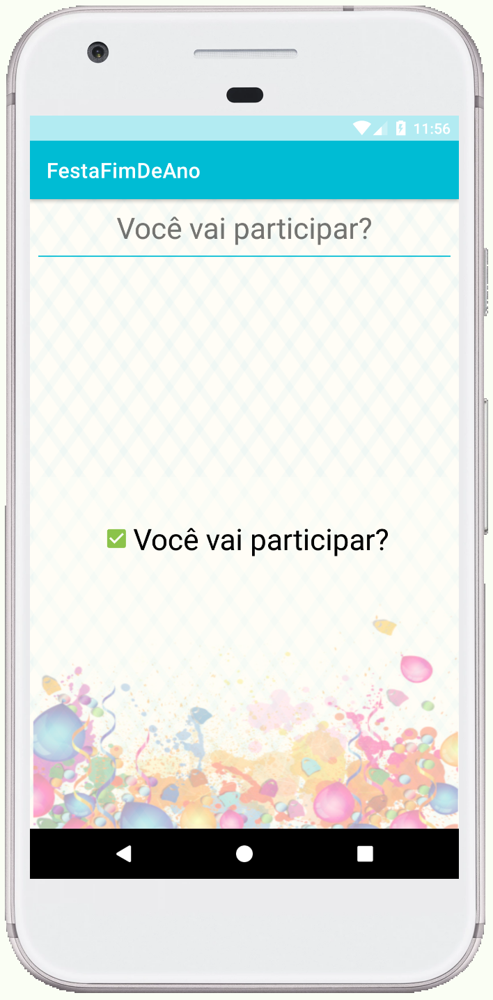
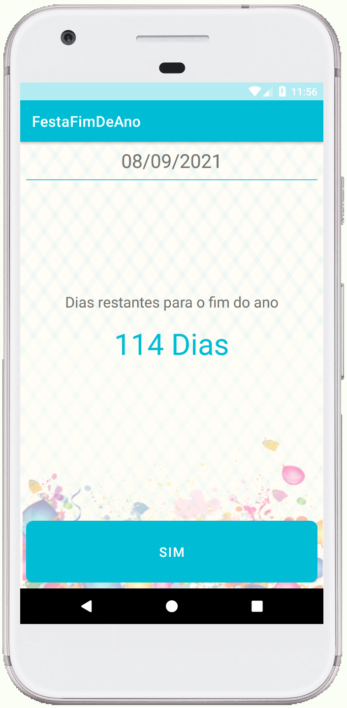
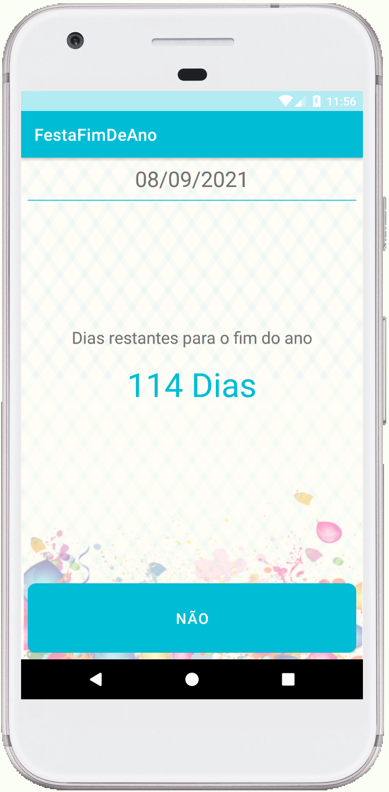

# Desenvolvedor Android Iniciante

Este repositório é referente ao curso da [DevMasterTeam](http://devmasterteam.com) disponível na plataforma Udemy.
- [Desenvolvedor Android Iniciante](https://www.udemy.com/desenvolvedor-android-iniciante).    

### **Conversor de moedas**
Nesta aplicação "Conversor de moedas", foi desenvolvida para receber um valor em Reais e converter em Dólar e Euro, considerando uma cotação mais próxima da realidade atual, considerei o valor em dólar US$ 5,00 e o valor em euro € 6,00.   
Nesta aplicação fazemos a criação do projeto do zero e a explicação da estrutura do Android Studio e arquivos criados. Passamos para manipulação de eventos de click e elementos de interface, alteração de layout e compreensão do LinearLayout usado para criar a aplicação.   

##### **Imagens da aplicação**

    

> Tela inicial da aplicação

    

> Tela apresentando um teclado númerico para a inclusão dos valores em reais para serem convertidos para Dólar e Euro.

    

> Tela com o resultado da conversão.

### **Festa de fim de ano**

Nesta aplicação "Festa de Fim de Ano", foi desenvolvida para calcular os dias restantes até o fim do ano, e será capaz de confirmar ou não a presença na festa de fim de ano.   
Realizamos a criação de mais de uma Activity para trabalhar com o conceito de navegação e definimos qual das activities será usada por padrão pelo Android.   
Fazemos também a manipulação de elementos de interface, entendimento de RelativeLayout e uso do SharedPreferences.  

##### **Imagens da aplicação**

    

> Tela inicial da aplicação

    
    

> Tela para selecionar a participação.

    

> Caso o usuário marque a opção Check ☑, e voltar a tela, irá alterar de "não confirmado" para "sim".

    

> Caso o usuário desmarque a opção Check ☑, e voltar a tela, irá alterar de "sim" para "não".

